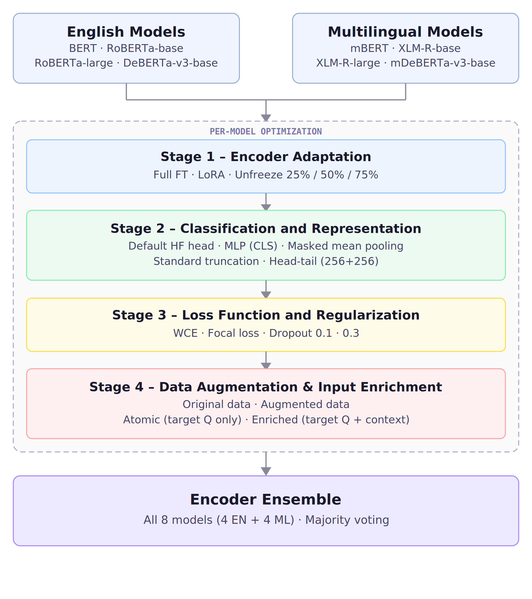

# CLaC at SemEval-2026 Task 6: Response Clarity Detection in Political Discourse

**Nawar Turk, Lucas Miquet-Westphal, Leila Kosseim** · CLaC Lab, Concordia University

Full experimental codebase for our SemEval-2026 CLARITY submission: a 4-stage encoder ablation across 8 transformer models, Longformer long-context experiments, and a systematic LLM prompting sweep, all with saved predictions, eval logs, and paper figures.

The repository covers both official tasks:

- `Task 1`: 3-way response clarity classification
- `Task 2`: 9-way fine-grained evasion classification

Dataset: 3,448 train / 308 dev / 237 test — English U.S. presidential interview transcripts from the QEvasion corpus.

This is an analysis-first repo, not just a training script dump. The central questions are:

- Does partial unfreezing beat full fine-tuning — and by how much?
- Do richer heads or truncation strategies help encoders?
- Does loss reshaping add anything after class weighting?
- Does LLM-generated augmentation help or hurt?
- Does extra interviewer context help encoders and LLMs equally?
- Does long-context modelling solve the over-length problem?



---

## Results

| Task | System | Macro-F1 | Rank |
|---|---|---|---|
| Task 1 — 3-way clarity | LLM Ensemble (GPT-5 + Gemini + Qwen3-235B) | **80.0** (test) · 78.1 (dev) | **9th / 41** |
| Task 2 — 9-way evasion | Same Task 1-optimized prompting setup and ensemble | **59.0** (test) | **3rd / 33** |

| System | Dev Macro-F1 |
|---|---|
| LLM Ensemble | 78.1 |
| Gemini-3-Flash-Preview (best single LLM) | 71.9 |
| GPT-5 | 71.5 |
| Encoder Ensemble (all 8 models, EN+Multi) | 70.5 |
| DeBERTa-v3-base (best single encoder) | 65.1 |
| Longformer-base-4096 | 64.3 |

Full tables: [results/prompt_global_f1_summary.csv](results/prompt_global_f1_summary.csv) · [results/encoder_f1_global_summary.csv](results/encoder_f1_global_summary.csv)

---

## Key Findings

1. **Partial unfreezing beats full fine-tuning by +17.9 F1.** Unfreezing only the top 25% of encoder layers averages 59.1 vs 41.2 for full fine-tuning, making it the highest-impact encoder choice.
2. **Stages 2 to 4 yield diminishing returns.** All 8 models independently selected WCE + dropout 0.1 in Stage 3; focal loss and heavier regularisation did not help.
3. **Data augmentation is model-dependent.** GPT-4o paraphrases of the minority class improved 3 models but decreased average macro-F1 across the full encoder family.
4. **Multilingual encoders help most in ensemble.** Multilingual-only ensemble (68.2) beats English-only (65.6); combining both reaches 70.5.
5. **Long-context modelling provides no gains.** Longformer (64.3) underperforms the best standard encoder despite many inputs exceeding 512 tokens.
6. **LLMs outperform encoders on minority classes.** Gains are largest on *Clear Reply* (+9.7) and *Clear Non-Reply* (+10.3).
7. **Enriched input helps LLMs but hurts encoders.** The same extra context yields opposite effects, suggesting LLMs use discourse context more effectively.
8. **The dominant error mirrors human disagreement.** *Clear Reply* versus *Ambivalent* confusion is the top failure mode for both ensembles, matching the weakest human agreement boundary.

---

## Evidence Map

Every central paper claim traces to a file here.

| Claim | File |
|---|---|
| Staged encoder design | [main.py](main.py) · [config/stage2.yaml](config/stage2.yaml) · [config/stage3.yaml](config/stage3.yaml) · [config/stage4.yaml](config/stage4.yaml) |
| Best encoder config per model | [config/best_models.yaml](config/best_models.yaml) |
| Partial unfreezing implementation | [models/encoders/s1_encoder_adaptation/train_freeze.py](models/encoders/s1_encoder_adaptation/train_freeze.py) |
| Augmentation pipeline | [datasets/augment_dataset_paraphrasing.py](datasets/augment_dataset_paraphrasing.py) |
| All prompt templates | [prompts](prompts) |
| Validation logic | [helpers/validate.py](helpers/validate.py) |
| F1 report generation | [helpers/generate_f1_report.py](helpers/generate_f1_report.py) |
| Global encoder results | [results/encoder_f1_global_summary.csv](results/encoder_f1_global_summary.csv) |
| Global LLM results | [results/prompt_global_f1_summary.csv](results/prompt_global_f1_summary.csv) |
| Longformer ablation | [models/encoders/longformer_experiments](models/encoders/longformer_experiments) · [paper_figures/longformer_ablation.png](paper_figures/longformer_ablation.png) |
| Prompting strategy comparison | [paper_figures/design_vs_model_dev_macro_f1.png](paper_figures/design_vs_model_dev_macro_f1.png) |
| Confusion matrices | [paper_figures/confusion_matrix_llm_ensemble.png](paper_figures/confusion_matrix_llm_ensemble.png) · [paper_figures/confusion_matrix_encoder_ensemble.png](paper_figures/confusion_matrix_encoder_ensemble.png) |

---

## Quickstart

```bash
pip install torch transformers datasets peft scikit-learn pandas numpy matplotlib \
            pyyaml openai anthropic google-generativeai huggingface_hub python-dotenv tqdm
```

Add API keys to `.env` (`OPENAI_API_KEY`, `ANTHROPIC_API_KEY`, `GEMINI_API_KEY`, `HF_TOKEN`), then:

```bash
# 1. Download dataset
python datasets/load_datasets.py

# 2. Run encoder stages (from project root)
python main.py --train-stage-2 && python main.py --predict-stage-2
python main.py --train-stage-3 && python main.py --predict-stage-3
python main.py --train-stage-4 && python main.py --predict-stage-4

# 3. Validate LLM outputs and generate F1 reports
python main.py --validate
python main.py --evaluate
```

**Stage 1 encoder training** (run directly):

```bash
python models/encoders/s1_encoder_adaptation/train_freeze.py --model_name roberta-base --param_mode fixed --unfreeze_ratio 0.25
python models/encoders/s1_encoder_adaptation/train_lora.py --model_name bert-base-uncased --param_mode fixed
```

**LLM inference** (check path, prompt, and provider settings at the top of each script):

```bash
python models/prompting/run_gpt_api.py
python models/prompting/run_hf_api.py
python models/prompting/run_gemini_api.py
```

> Encoder experiments are self-contained. LLM inference and augmentation require external API access, and some preserved prompt scripts need local path or template edits before rerunning.

**Hardware:** NVIDIA RTX 4070 12GB · Python 3.12.7 · PyTorch 2.5.1 · Transformers 4.51.3

---

## Structure

| Path | Contents |
|---|---|
| [main.py](main.py) | Central CLI for encoder stages, validation, and evaluation |
| [config](config) | Stage sweep YAMLs and best-model registry |
| [datasets](datasets) | Data loading, splits, augmentation |
| [prompts](prompts) | LLM prompt templates (`{Q}` / `{A}` placeholders) |
| [models/encoders](models/encoders) | Encoder and Longformer training and prediction (s1 to s4) |
| [models/prompting](models/prompting) | LLM API runners for Task 1 and Task 2 |
| [models/binary_prompting](models/binary_prompting) | One-vs-rest binary prompting experiments |
| [helpers](helpers) | Validation, F1 reporting, few-shot prompt generation |
| [results](results) | Predictions, eval logs, summary CSVs |
| [paper_figures](paper_figures) | Publication-ready figures |

---

## Start Here

If you only open a few files, start with these:

- [config/best_models.yaml](config/best_models.yaml) — best encoder config per stage
- [results/encoder_f1_global_summary.csv](results/encoder_f1_global_summary.csv) — all 136+ encoder runs in one table
- [results/prompt_global_f1_summary.csv](results/prompt_global_f1_summary.csv) — all LLM runs in one table
- [paper_figures/design_vs_model_dev_macro_f1.png](paper_figures/design_vs_model_dev_macro_f1.png) — prompting strategy vs model comparison
- [paper_figures/longformer_ablation.png](paper_figures/longformer_ablation.png) — Longformer 12-config ablation
- [paper_figures/confusion_matrix_llm_ensemble.png](paper_figures/confusion_matrix_llm_ensemble.png) — where the ensembles fail

---

## Bottom Line

Careful staged analysis matters more than any single trick. Partial unfreezing is the most impactful encoder decision. Long-context modelling does not rescue the task. Enriched context helps LLMs but not encoders. And the dominant failure mode, *Clear Reply* versus *Ambivalent* confusion, mirrors human annotator disagreement, showing that the boundary reflects genuine linguistic ambiguity. The ensemble wins by combining systems with complementary behaviour on a genuinely hard problem.
